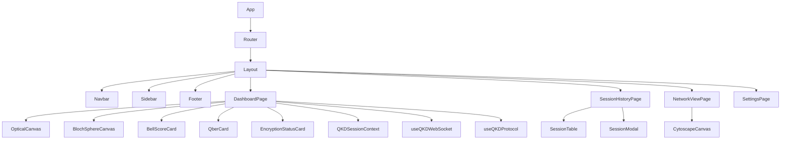
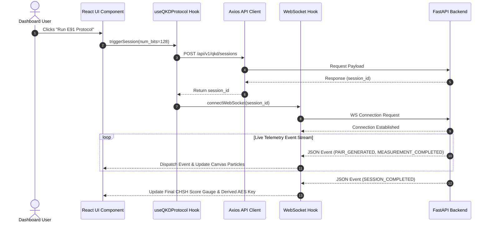

# EntangleNet: Frontend Architecture & Design Specification Manual

Welcome to the official frontend architecture specification and engineering design guide for **EntangleNet QKD Studio** — a futuristic, high-performance React + TypeScript single-page application for Quantum Key Distribution (QKD) simulation, network topology visualizer, and telemetry monitoring platform.

---

## Table of Contents
1. [Project Overview](#1-project-overview)
2. [Complete Folder Structure](#2-complete-folder-structure)
3. [Routing](#3-routing)
4. [Pages](#4-pages)
5. [Components](#5-components)
6. [API Integration](#6-api-integration)
7. [State Management](#7-state-management)
8. [Charts](#8-charts)
9. [Network Visualization](#9-network-visualization)
10. [WebSocket Integration](#10-websocket-integration)
11. [Theme & Aesthetics](#11-theme--aesthetics)
12. [Animation Plan](#12-animation-plan)
13. [Complete UI Wireframes](#13-complete-ui-wireframes)
14. [Component Dependency Diagram](#14-component-dependency-diagram)
15. [Data Flow Diagram](#15-data-flow-diagram)
16. [Recommended Tech Stack](#16-recommended-tech-stack)

---

## 1. Project Overview

### High-Level Architecture
**EntangleNet Frontend** is designed as a modular, state-of-the-art React 18 single-page application built with Vite and TypeScript. It communicates with the EntangleNet FastAPI backend via two distinct communication channels:
1. **Stateless HTTP REST Control Plane (Axios)**: For issuing session execution commands (`POST /api/v1/qkd/sessions`), fetching historical session records (`GET /api/v1/qkd/sessions`), paginating logs, and inspecting backend health (`GET /api/v1/health`).
2. **Duplex WebSocket Live Telemetry Plane (Native WebSocket / Custom Hook)**: For streaming real-time quantum lifecycle events (`ws://localhost:8000/api/v1/ws/qkd/sessions/{session_id}`) directly into reactive state containers and animated canvas visualizers without HTTP polling overhead.

### Overall Data Flow
```
┌────────────────────────────────────────────────────────────────────────────────────────┐
│                               REACT 18 FRONTEND APPLICATION                             │
│                                                                                        │
│  ┌───────────────────────┐    ┌───────────────────────┐    ┌────────────────────────┐  │
│  │   UI Pages & Views    │    │  Global State Context │    │ WebSocket Subscription │  │
│  │ (Dashboard, NetView)  │◄───┤  (SessionContext,     │◄───┤   Custom Hook          │  │
│  │                       │    │   ThemeContext)       │    │  (useQKDWebSocket)     │  │
│  └───────────┬───────────┘    └───────────────────────┘    └───────────▲────────────┘  │
│              │                                                         │               │
└──────────────┼─────────────────────────────────────────────────────────┼───────────────┘
               │ (HTTP REST Axios)                                       │ (WebSocket Event Stream)
               ▼                                                         │
┌────────────────────────────────────────────────────────────────────────┴───────────────┐
│                               ENTANGLENET FASTAPI BACKEND                              │
│                                                                                        │
│  ┌───────────────────────┐    ┌───────────────────────┐    ┌────────────────────────┐  │
│  │ REST Controllers      │───►│ QKDSessionService     │───►│ WebSocket Publisher    │  │
│  │ (/api/v1/qkd/sessions)│    │ (E91Protocol Runner)  │    │ (/api/v1/ws/qkd/...)   │  │
│  └───────────────────────┘    └───────────────────────┘    └────────────────────────┘  │
└────────────────────────────────────────────────────────────────────────────────────────┘
```

---

## 2. Complete Folder Structure

```
src/
├── api/                  # Axios HTTP client, API route definitions, interceptors
│   ├── client.ts         # Centralized Axios instance with timeout and base URL config
│   ├── endpoints.ts      # Type-safe API endpoints definitions
│   └── qkdApi.ts         # QKD session API calls (createSession, fetchSessionById, listSessions)
├── animations/           # Framer Motion variants & Canvas animation engines
│   ├── blochSphere.ts    # 3D Bloch sphere vector rotation math & rendering
│   ├── photonBeam.ts     # HTML5 Canvas particle emission & trajectory engines
│   └── transitions.ts    # Page and modal entrance/exit animation variants
├── assets/               # Static graphics, SVG icons, fonts, branding
│   ├── icons/            # Quantum icons (EPR pair, Bloch sphere, Lock, Laser)
│   └── logo.svg          # EntangleNet branded vector logo
├── charts/               # Recharts component wrappers
│   ├── BellScoreChart.tsx # CHSH parameter S violation curve chart
│   ├── ExecutionTimeChart.tsx # Hardware runtime distribution chart
│   ├── KeyLengthChart.tsx # Sifting efficiency & key length chart
│   ├── QberTrendChart.tsx # Quantum bit error rate trend chart
│   └── SuccessRateChart.tsx # Protocol outcome pie/donut chart
├── components/           # Reusable UI component library
│   ├── common/           # Generic atomic components (Button, Card, Badge, Modal, Tooltip)
│   │   ├── Badge.tsx
│   │   ├── Button.tsx
│   │   ├── Card.tsx
│   │   ├── LoadingScreen.tsx
│   │   ├── Modal.tsx
│   │   └── ThemeToggle.tsx
│   ├── dashboard/        # Dashboard-specific widget panels
│   │   ├── BackendStatusCard.tsx
│   │   ├── BellScoreCard.tsx
│   │   ├── EncryptionStatusCard.tsx
│   │   ├── ExecutionTimeline.tsx
│   │   ├── MetricCards.tsx
│   │   ├── QberCard.tsx
│   │   └── WebSocketStatusCard.tsx
│   ├── layout/           # Structural layout wrappers
│   │   ├── Footer.tsx
│   │   ├── Header.tsx
│   │   ├── Layout.tsx
│   │   ├── Navbar.tsx
│   │   └── Sidebar.tsx
│   └── sessions/         # Session history table components
│       ├── SessionFilter.tsx
│       ├── SessionModal.tsx
│       └── SessionTable.tsx
├── contexts/             # React Context Providers for global state
│   ├── QKDSessionContext.tsx # Active session state, trigger actions, historical logs
│   ├── ThemeContext.tsx      # Dark/Futuristic theme mode switcher
│   └── WebSocketContext.tsx  # Global socket connection state & message dispatcher
├── hooks/                # Reusable custom React hooks
│   ├── useAESPlayground.ts   # Local/remote AES encryption/decryption handler
│   ├── useQKDProtocol.ts     # QKD session trigger & status manager
│   ├── useQKDWebSocket.ts    # Socket connection, reconnect loop, event parser
│   └── useTheme.ts           # Access theme context
├── network/              # Cytoscape.js quantum network graph visualizer
│   ├── CytoscapeCanvas.tsx   # Cytoscape container component
│   ├── networkConfig.ts      # Node styles, edge weights, glowing animations
│   └── networkData.ts        # Topology mock data (Alice, Bob, Charlie, Eve nodes)
├── pages/                # Top-level view routes
│   ├── AboutPage.tsx         # Protocol mechanics & quantum physics docs
│   ├── DashboardPage.tsx     # Primary live telemetry & visual studio dashboard
│   ├── HomePage.tsx          # Landing overview & quick start portal
│   ├── NetworkViewPage.tsx   # Multi-node quantum network topology view
│   ├── SessionHistoryPage.tsx# Historical session table & log inspection
│   └── SettingsPage.tsx      # IBM Quantum API token & simulator config
├── services/             # Helper business logic services
│   ├── aesService.ts     # AES payload formatting & key transformation
│   └── entropyCalculator.ts # Shannon entropy math calculations
├── styles/               # Global CSS & TailwindCSS configuration
│   ├── globals.css       # Tailwind directives, CSS variables, glassmorphism utilities
│   └── theme.css         # Color palette tokens (Cyan, Purple, Magenta, Emerald, Gold)
├── types/                # TypeScript type definitions & interfaces
│   ├── api.ts            # REST request & response DTO types
│   ├── qkd.ts            # Domain types (QKDResult, SessionStatus, MeasurementPair)
│   └── websocket.ts      # WebSocket event types & payload schemas
├── utils/                # Pure utility functions
│   ├── formatters.ts     # Hex formatting, bitstring truncators, date formatters
│   └── validators.ts     # Number of bits range validator, API key check
├── App.tsx               # Main application component with router & provider providers
└── main.tsx              # Application entrypoint
```

---

## 3. Routing

The application uses **React Router v6** (`react-router-dom`) with declarative layout routing and page fallback boundaries.

```
App.tsx
 └── BrowserRouter
      └── Layout (Header, Sidebar, Footer)
           ├── Route "/"                 ──► HomePage
           ├── Route "/dashboard"        ──► DashboardPage
           ├── Route "/sessions"         ──► SessionHistoryPage
           ├── Route "/network"          ──► NetworkViewPage
           ├── Route "/settings"         ──► SettingsPage
           ├── Route "/about"            ──► AboutPage
           └── Route "*"                 ──► NotFoundPage (404)
```

---

## 4. Pages

### 1. HomePage (`HomePage.tsx`)
- **Purpose**: Welcoming landing page introducing EntangleNet.
- **Key Features**: High-level value proposition, interactive "Quick Start Demo" button, live system health ping status, and links to protocol documentation.

### 2. DashboardPage (`DashboardPage.tsx`)
- **Purpose**: Primary interactive QKD control center and optical telemetry workbench.
- **Key Features**:
  - Live Optical Fiber Canvas (glowing photon particles moving between EPR source, Alice, Bob, and Eve).
  - Qubit Basis Selector & 3D Bloch sphere visualizers.
  - CHSH Bell inequality parameter $S$ violation gauge card.
  - Key sifting efficiency & QBER error progress indicators.
  - Interactive AES-256-GCM encryption/decryption sandbox.

### 3. SessionHistoryPage (`SessionHistoryPage.tsx`)
- **Purpose**: Comprehensive historical log and audit trail of all previous QKD runs.
- **Key Features**: Paginated `SessionTable`, search by session ID, status filter badges (`COMPLETED`, `ABORTED_EAVESDROPPING`), export logs as JSON/CSV, and inspect detailed protocol modal views.

### 4. NetworkViewPage (`NetworkViewPage.tsx`)
- **Purpose**: Multi-node quantum network topology visualization powered by Cytoscape.js.
- **Key Features**: Interactive node graph showing Quantum Repeaters, Optical Switch Nodes, Alice/Bob Terminals, and Eve Intercept Nodes with glowing particle edge animations.

### 5. SettingsPage (`SettingsPage.tsx`)
- **Purpose**: Configuration center for quantum hardware and simulation settings.
- **Key Features**: IBM Quantum API token input, target hardware backend selector (`ibm_brisbane`, `ibm_kyiv`, `aer_simulator`), fallback simulation toggle, and default shot count settings.

### 6. AboutPage (`AboutPage.tsx`)
- **Purpose**: Educational reference manual detailing Ekert 91 physics.
- **Key Features**: Interactive math equations (CHSH inequality $S \le 2.0$ vs $S = 2\sqrt{2}$), Bell state statevector definitions, and No-Cloning theorem explanations.

---

## 5. Components

| Component | Category | Responsibilities |
| :--- | :--- | :--- |
| `Navbar` | Layout | Top navigation bar with logo, backend status badge, WebSocket status indicator, theme switcher. |
| `Sidebar` | Layout | Collapsible sidebar drawer with navigation icons (`Home`, `Dashboard`, `History`, `Network`, `Settings`). |
| `MetricCards` | Dashboard | Summary metrics grid displaying Total Sessions, Success Rate, Average Bell Score, and Total Keys Generated. |
| `StatusCards` | Dashboard | Active session status pill (`IDLE`, `RUNNING`, `COMPLETED`, `ABORTED_EAVESDROPPING`). |
| `SessionTable` | Sessions | Data table rendering historical sessions with sorting, pagination, and action buttons. |
| `BellScoreCard` | Dashboard | Radial gauge & correlation table for CHSH parameter $S$ ($S > 2.0$ vs $S \le 2.0$). |
| `QberCard` | Dashboard | Progress bar and error percentage display tracking QBER against the 11% security threshold. |
| `BackendStatus` | Dashboard | Displays connected quantum backend (`AerSimulator` vs `IBM Quantum Hardware`). |
| `ExecutionTimeline` | Dashboard | Step-by-step visual timeline tracking session progress (`Pair Gen` ➔ `Measure` ➔ `CHSH` ➔ `Sift` ➔ `AES`). |
| `WebSocketStatus` | Dashboard | Real-time WebSocket connection state badge (`Connecting`, `Connected`, `Closed`). |
| `EncryptionStatus` | Dashboard | AES-256-GCM playground showing key hex, plaintext input, ciphertext, nonce, and auth tag. |
| `LoadingScreen` | Common | Full-page glassmorphism loader with rotating quantum orbit spinner. |
| `NetworkGraph` | Network | Interactive Cytoscape.js canvas showing node topology and photon pulse edges. |
| `ThemeToggle` | Common | Button toggling dark futuristic quantum theme. |
| `Footer` | Layout | Persistent footer displaying platform version and copyright information. |

---

## 6. API Integration

### REST Endpoints Integration

| Endpoint | Method | Component / Page | Purpose |
| :--- | :--- | :--- | :--- |
| `/api/v1/qkd/sessions` | `POST` | `DashboardPage`, `useQKDProtocol` | Initiates new QKD session with target `num_bits`. |
| `/api/v1/qkd/sessions/{id}` | `GET` | `SessionModal`, `SessionHistoryPage` | Fetches complete execution record for a specific session. |
| `/api/v1/qkd/sessions` | `GET` | `SessionHistoryPage` | Fetches paginated list of past QKD session records. |
| `/api/v1/health` | `GET` | `Navbar`, `BackendStatusCard` | Pings backend service health status. |

### WebSocket Endpoint Integration

| Endpoint | Protocol | Component / Page | Purpose |
| :--- | :--- | :--- | :--- |
| `/api/v1/ws/qkd/sessions/{id}` | `WS` | `useQKDWebSocket`, `DashboardPage` | Streams real-time JSON `SessionEvent` records (`SESSION_STARTED`, `PAIR_GENERATED`, `MEASUREMENT_COMPLETED`, `CHSH_COMPLETED`, `KEY_SIFTED`, `SESSION_COMPLETED`). |

---

## 7. State Management

The application utilizes a **hybrid state management strategy**:

```
                               ┌──────────────────────────────────┐
                               │       Global State Contexts      │
                               │  (Theme, WS Connection, Auth)    │
                               └────────────────┬─────────────────┘
                                                │
                 ┌──────────────────────────────┴──────────────────────────────┐
                 ▼                                                             ▼
┌──────────────────────────────────┐                         ┌──────────────────────────────────┐
│      QKDSessionContext           │                         │       Custom Hooks               │
│ (Active Session, Logs, Key Hex)  │                         │ (useQKDProtocol, useQKDWebSocket)│
└────────────────┬─────────────────┘                         └────────────────┬─────────────────┘
                 │                                                             │
                 └──────────────────────────────┬──────────────────────────────┘
                                                │
                                                ▼
                               ┌──────────────────────────────────┐
                               │   Local Component UI State       │
                               │ (Form inputs, Modals, Sliders)   │
                               └──────────────────────────────────┘
```

1. **Global Context (`QKDSessionContext`)**: Stores active session metadata, execution logs, derived secret key, and current session status.
2. **WebSocket Context (`WebSocketContext`)**: Manages the socket connection instance, auto-reconnect loops, and message dispatchers.
3. **Custom Hooks (`useQKDProtocol`, `useQKDWebSocket`)**: Encapsulate API invocation logic, WebSocket listeners, error handling, and cleanup logic.
4. **Local Component State (`useState`)**: Manages ephemeral UI states such as slider values (`num_bits`), toggle switches (Eve Active), and modal open/close states.

---

## 8. Charts

All charts are implemented using **Recharts** wrapped in responsive glassmorphism containers:

1. **Bell Score Chart (`BellScoreChart.tsx`)**:
   - Area chart plotting CHSH parameter $S$ values across historical runs.
   - Includes horizontal reference lines at $S = 2.0$ (Classical Limit) and $S = 2.828$ (Tsirelson Bound).
2. **QBER Trend Chart (`QberTrendChart.tsx`)**:
   - Line chart displaying Quantum Bit Error Rates over time.
   - Highlights safety zone ($\text{QBER} < 11\%$) vs danger zone ($\text{QBER} \ge 11\%$).
3. **Execution Time Chart (`ExecutionTimeChart.tsx`)**:
   - Bar chart comparing total execution duration (ms) across different quantum backends (`AerSimulator` vs `IBM Hardware`).
4. **Key Length Chart (`KeyLengthChart.tsx`)**:
   - Grouped bar chart comparing Generated Raw EPR Pairs vs Retained Sifted Key Bits.
5. **Success Rate Chart (`SuccessRateChart.tsx`)**:
   - Donut chart showing ratio of `COMPLETED` (Secure) vs `ABORTED_EAVESDROPPING` sessions.

---

## 9. Network Visualization

The **Network View Page** uses **Cytoscape.js** for rendering an interactive 2D quantum topology graph.

### Node Types
- **Node Type 1: EPR Source Node (Center)**: Renders as a glowing purple circle with pulsing halo.
- **Node Type 2: Alice Terminal Node (Left)**: Renders as a cyan terminal node with node label and active measurement angle.
- **Node Type 3: Bob Terminal Node (Right)**: Renders as a magenta terminal node.
- **Node Type 4: Eve Intercept Node (Top/Channel)**: Renders as a red warning node when Eve is active.
- **Node Type 5: Quantum Repeater Nodes**: Intermediate nodes extending key distribution range.

### Edge Styles & Animations
- **Secure Channel Edge**: Smooth curved line with glowing cyan particle animation moving along the edge.
- **Eavesdropped Channel Edge**: Red dashed line with flickering noise particles indicating state collapse.

---

## 10. WebSocket Integration

### Connection Lifecycle
```
[Unconnected] ──► [Connecting...] ──► [Connected / Subscribed] ──► [Live Event Stream]
      ▲                                       │                             │
      │                                       ▼                             │
      └───────── [Auto-Reconnect Loop] ◄── [Socket Closed / Error] ◄────────┘
```

1. **Initiation**: When a QKD session is triggered, `useQKDWebSocket` establishes a connection to `ws://localhost:8000/api/v1/ws/qkd/sessions/{session_id}`.
2. **Heartbeat & Keep-Alive**: Sends periodic ping frames every 30 seconds to maintain connection.
3. **Auto-Reconnect**: Exponential backoff reconnect strategy (attempts reconnect at 1s, 2s, 4s, 8s).
4. **Event Parsing**: Parses incoming JSON frames and dispatches actions to update `QKDSessionContext` and trigger canvas particle pulses.

---

## 11. Theme & Aesthetics

The UI adheres strictly to a **Futuristic Dark Quantum Theme** using HSL color variables and glassmorphism.

### Color Palette (Tailwind / CSS Tokens)
- **Deep Space Background**: `hsl(230, 35%, 7%)` (`#0b0d17`)
- **Glass Card Background**: `hsla(228, 39%, 12%, 0.75)` with `backdrop-filter: blur(16px)`
- **Quantum Cyan Accent**: `hsl(184, 100%, 50%)` (`#00f0ff`) — Used for Alice, primary buttons, secure status
- **Entanglement Purple Accent**: `hsl(272, 100%, 55%)` (`#9d4edd`) — Used for EPR Source, Bell scores
- **Bob Magenta Accent**: `hsl(322, 100%, 50%)` (`#ff007f`) — Used for Bob terminal
- **Emerald Green Accent**: `hsl(157, 100%, 50%)` (`#00ff9d`) — Used for success states and QBER safety
- **Security Gold Accent**: `hsl(43, 100%, 50%)` (`#ffb700`) — Used for AES encryption keys
- **Eavesdropper Red Accent**: `hsl(4, 100%, 58%)` (`#ff3b30`) — Used for Eve alerts and session aborts

---

## 12. Animation Plan

All UI micro-interactions and canvas visualizers use **Framer Motion** and **HTML5 2D Canvas API**:

1. **Photon Movement Animation**: Canvas particle engine rendering glowing photon pairs emitting from EPR Source and traveling to Alice/Bob nodes.
2. **Bell Pair Entanglement Animation**: SVG wave line pulsing between Alice and Bob nodes with quantum phase rotation.
3. **Bloch Sphere Rotation**: Smooth 60fps vector rotation when new measurement angles ($\theta_A, \theta_B$) are selected.
4. **Key Generation Animation**: Sifted bit stream revealing bits one by one with a glowing typewriter effect.
5. **Live Metrics Counter**: Smooth numerical interpolation (`framer-motion` `useSpring`) when values like $S = 2.828$ update.

---

## 13. Complete UI Wireframes

### 1. Main Dashboard Page (`/dashboard`)
```
+-----------------------------------------------------------------------------------+
|  [Logo] EntangleNet QKD Studio        [AerBackend] [WS: Connected] [Status: IDLE] |
+-----------------------------------------------------------------------------------+
|  Bits: [====|===] 128    Eve: (o) Inactive    Backend: [Aer Simulator ▼]  [START ⚡] |
+-----------------------------------------------------------------------------------+
|  MODULE 1: OPTICAL CHANNEL PHOTON TRAJECTORY                                      |
|  +-----------------------------------------------------------------------------+  |
|  |  (Alice Node) ======> [ EPR Pair Source |Φ+⟩ ] ======> (Bob Node)           |  |
|  +-----------------------------------------------------------------------------+  |
+--------------------------------------------------+--------------------------------+
|  MODULE 2: QUBIT BLOCH SPHERES                   |  MODULE 3: CHSH BELL TEST      |
|  +--------------------+  +--------------------+  |  Score S: [ 2.828 ] (GAUGE)    |
|  |  (Alice Sphere)    |  |  (Bob Sphere)      |  |  Verdict: ✓ S > 2.0 (Secure)   |
|  |  Angle: 0.0° (A1)  |  |  Angle: 45.0° (B1) |  |  E(A1,B1): 0.707               |
|  +--------------------+  +--------------------+  +--------------------------------+
+--------------------------------------------------+--------------------------------+
|  MODULE 4: KEY SIFTING & QBER                    |  MODULE 5: AES-256-GCM CRYPTO  |
|  Pairs: 512 | Sifted: 128 | Efficiency: 25%      |  Key: [ 4F8E...A910 ]          |
|  QBER: [==--------] 1.5% (Max 11%)               |  Payload: "Secret message..."  |
|  Bits: 101100101100...                           |  [ ENCRYPT ]  [ DECRYPT ]      |
+--------------------------------------------------+--------------------------------+
```

### 2. Session History Page (`/sessions`)
```
+-----------------------------------------------------------------------------------+
|  SESSION HISTORY AUDIT LOGS                           [ Search Session ID... ]    |
+-----------------------------------------------------------------------------------+
|  Session ID   | Timestamp       | Status      | S Score | QBER  | Actions        |
|---------------+-----------------+-------------+---------+-------+----------------|
|  qkd-8f92a1   | 2026-07-28 20:55 | COMPLETED   | 2.828   | 1.2%  | [ View Details]|
|  qkd-3c11b4   | 2026-07-28 20:52 | ABORTED_EVE | 1.414   | 25.0% | [ View Details]|
|  qkd-1a44e9   | 2026-07-28 20:48 | COMPLETED   | 2.812   | 1.8%  | [ View Details]|
+-----------------------------------------------------------------------------------+
|  Page 1 of 5                                               [ Previous ]  [ Next ] |
+-----------------------------------------------------------------------------------+
```

---

## 14. Component Dependency Diagram



---

## 15. Data Flow Diagram



---

## 16. Recommended Tech Stack

| Technology | Purpose | Selection Rationale |
| :--- | :--- | :--- |
| **React 18** | UI Framework | Component-based, concurrent rendering, rich ecosystem. |
| **Vite 5** | Build Tool & Dev Server | Ultra-fast HMR, instant startup, optimized production bundles. |
| **TypeScript 5** | Static Typing | Type safety across REST DTOs, WebSocket events, and domain models. |
| **TailwindCSS 3** | Utility-First Styling | Rapid design system implementation with custom HSL theme tokens. |
| **Framer Motion** | Declarative Animations | Smooth 60fps micro-animations, page transitions, and spring metrics. |
| **Cytoscape.js** | Network Graph Library | High-performance canvas-based network graph rendering for QKD topology. |
| **Recharts** | Data Visualization | Composably styled SVG charts for Bell parameter $S$ and QBER trends. |
| **Axios** | HTTP REST Client | Promises, request/response interceptors, typed response payloads. |
| **Lucide-React** | Icon Library | Sleek, modern vector icons for quantum navigation and controls. |

---

*This specification serves as the official blueprint for building the EntangleNet React Frontend.*
